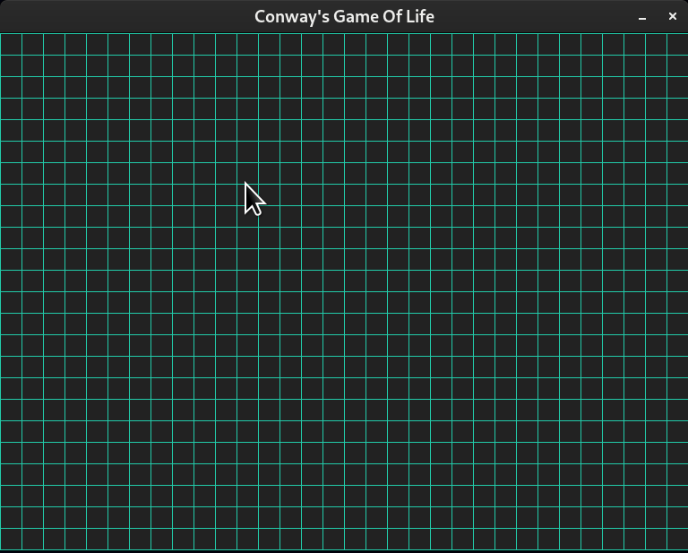

## Conway's Game of Life.

### Depends on *SDL2* library.

### Run *make* command to build project.

### Run with *./cgol*

### Left mouse button to activate cell

### Right mouse button to disable cell

### SPACE to pause / unpause

### R to reset

### Q to exit

